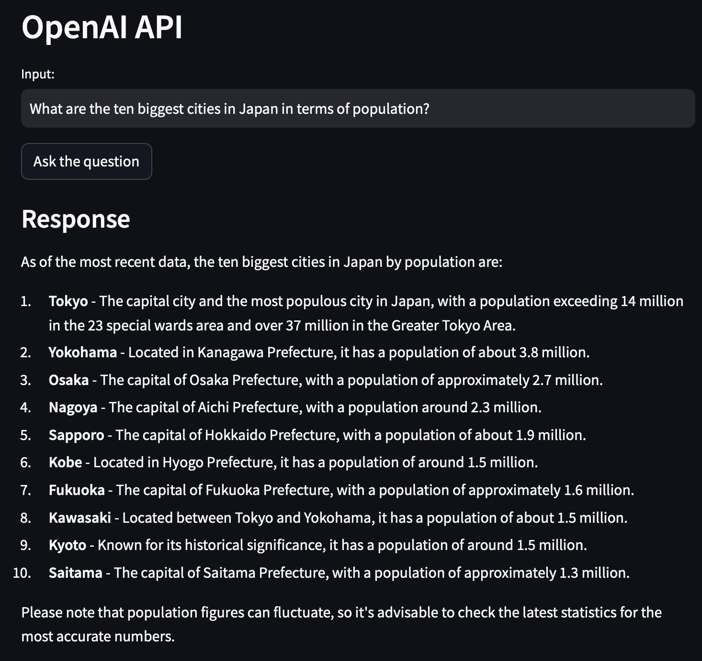

## Simple Chatbot App with OpenAI API

This repository contains the code for [a very simple chatbot](https://huggingface.co/spaces/Sang172/practice_QandA_chatbot) I created using Streamlit and OpenAI's API.

It's based on the GPT 4o mini model and is deployed on huggingface.

It has a maximum limit of 1,000 tokens for the output.

